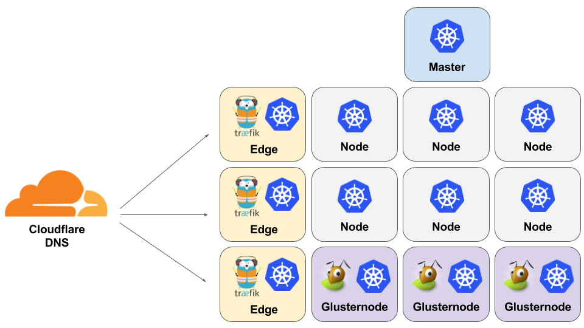

[](https://travis-ci.org/kubenow/KubeNow)
[](http://kubenow.readthedocs.io)
<span class="badge-slack"><a href="https://kubenow-slackin.herokuapp.com" title="Invite yourself to our Slack team"></a></span>
<span class="badge-patreon"><a href="https://patreon.com/kubenow" title="Donate to this project using Patreon"></a></span>

KubeNow is a cloud agnostic platform for microservices, based on Docker and Kubernetes. Other than lighting-fast Kubernetes operations, KubeNow helps you in lifting your final application configuring DNS records and distributed storage. Once you have defined your application as a Helm package, lifting it is as simple as:

```bash
kn init <aws|gce|openstack|azure> my-awesome-deployemt
cd my-awesome-deployemt
kn apply
kn helm install my-app-package
```

## Table of Contents

- [Architecture](#architecture)
- [Manifesto](#manifesto)
- [Getting Started](#getting-started)
- [Donate](#donate)
- [Roadmap](#roadmap)

## Architecture
Deploying a KubeNow cluster you will get:

 - A Kubernetes cluster up and running in ~10 minutes (provisioned with [kubeadm](http://kubernetes.io/docs/getting-started-guides/kubeadm/))
 - [Flannel](https://github.com/coreos/flannel) networking
 - [Traefik](https://traefik.io/) HTTP reverse proxy and load balancer
 - [Cloudflare](https://www.cloudflare.com/) dynamic DNS configuration
 - [GlusterFS](https://www.gluster.org/) distributed file system



In a KubeNow cluster there are 3 instance types:

- **master**: it runs the Kubernetes master, and it optionally acts as an ingress controller proxying from the Internet to the application services through its public IP.
- **node**: it runs a Kubernetes node and it hosts application services.
- **edge**: it is a specialized kind of node with a public IP associated, it acts as an ingress controller proxying from the Internet to the application services. It can run application services as well. Edge nodes are optional.
- **glusternode**: it is a specialized kind of node that runs only a GlusterFS server. One or more *glusternodes* can be used to provide distributed storage for the application services. Glusternodes are optional.

**Cloudflare** can be optionally used to setup DNS records and SSL/TSL (HTTPS) encryption.

## Manifesto

- We want fast deployments: each instance provision itself independently and immutable images are used
- We use existing provisioning tools: [Terraform](https://www.terraform.io/), [Packer](https://www.packer.io/), [Ansible](https://www.ansible.com/) and [kubeadm](http://kubernetes.io/docs/getting-started-guides/kubeadm)
- We avoid resources that are available only for a specific cloud provider
- We provision IaaS, PaaS and SaaS: lifting a distributed application should be possible with a few commands

## Getting started
Want to try KubeNow? The documentation is available at http://kubenow.readthedocs.io.

## Donate
You can support KubeNow throug [Patreon](https://patreon.com/kubenow), more information available at https://patreon.com/kubenow.

## Roadmap

### Core
- [x] Kubernetes
- [ ] High Availability
- [x] Scaling
- [ ] Autoscaling
- [ ] Dashboard

### Cloud Providers
- [x] OpenStack
- [x] Google Cloud Platform
- [x] Amazon Web Services
- [x] Microsoft Azure
- [ ] Local
- [ ] Bare Metal

### Load balancer
- [x] Traefik

### Networking
- [x] Flannel

### Big Data Frameworks
- [ ] Spark

### Storage
- [x] GlusterFS

### SSL/TSL (HTTPS)
- [x] Cloudflare
- [ ] Let's Encrypt
